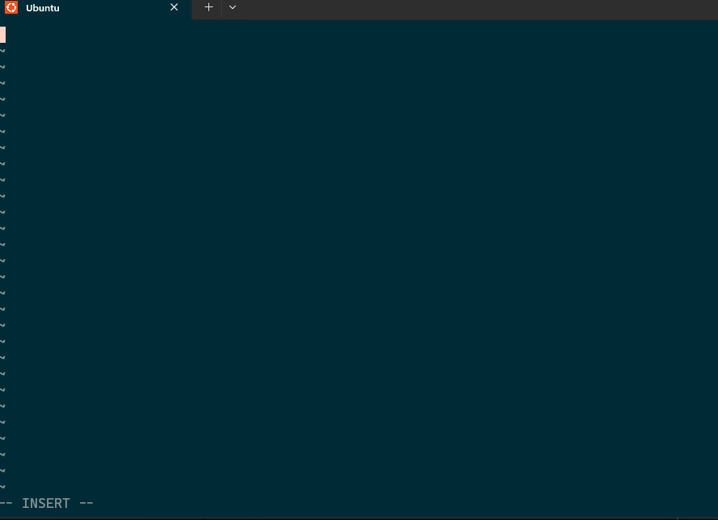
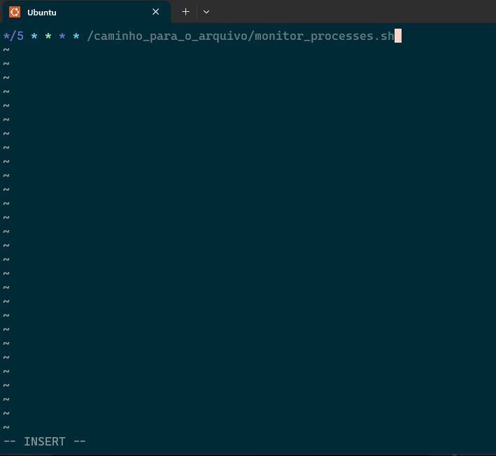
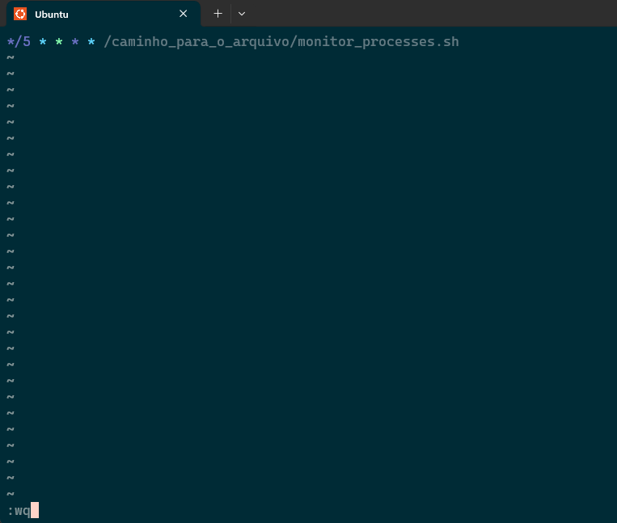

# Monitor de Processos

## Passo a Passo

1 - Necessario dar a permissão de execução ao script par isso use o comando: 
    "chmod +x monitor_processes.sh"

2 - Para adicionar ao cron o comando seria:

    "crontab -e"
EX:

3 - Aperta a letra "i" para conseguir inserir informações, apos isso adicione esse comando para o que o script rode a cada 5 minutos:

    "*/5 * * * * /caminho_para_o_arquivo/monitor_processes.sh"
EX:

4 - Por fim aperte "ESC" para sair do modo de edição e salve com o comando ":wq"
EX: